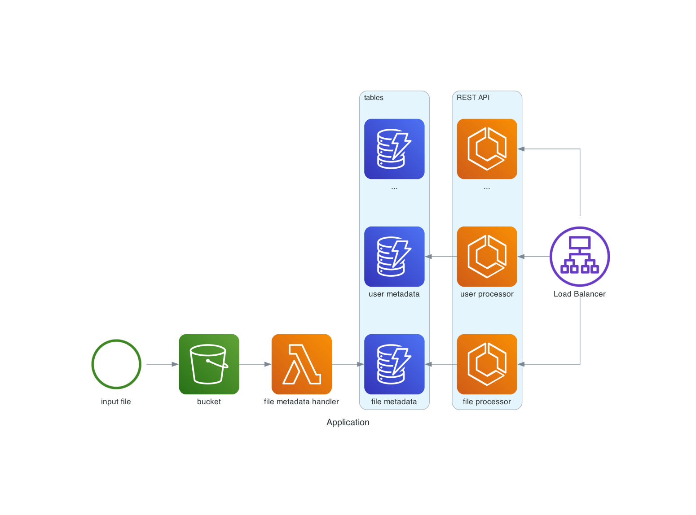

Kucharz
=======
# Jakub Spórna

## 15 lat doświadczenia w sieciach
## 10 lat doświadczenia w DevOps
## 8 lat doświadczenia w AWS
### Python developer z zamiłowania niż konieczności


<!-- end_slide -->

Składniki
=========

## Co potrzebujemy:
<!-- pause -->

<!-- incremental_lists: true -->
* Chmura &rarr; AWS
* Infrastructure as Code &rarr; Terraform
* Chmura lokalna &rarr; LocalStack

<!-- pause -->

### Dodatki
<!-- pause -->
<!-- incremental_lists: true -->
* docker
* awslocal
* tflocal

<!-- end_slide -->

AWS
===

# Amazon Web Services

## Prywatna

Początki są datowane na okolice 2002 roku kiedy usługi były na potrzeby wewnętrzne platformy *merchant.com*

## Publiczna

Pierwsze upublicznienie usługi miało miejsce w 2004 roku.

- Simple Queue Service (**SQS**) - 11.2004
- Simple Storage Service (**S3**) - 03.2006
- Elastic Compute Cloud (**EC2**) - 08.2006

### Stan aktualny

Ponad 200 serwisów.

<!-- end_slide -->

Terraform
=========

Oprogramowanie stworzone przez HashiCorp do zarządzania infrastrukturą w modelu Infrastructure as Code.

Korzysta z deklaratywnego języka HashiCorp Configuration Language (**HCL**), który jest podzbiorem formatu JSON.  
Terraform obsługuje oba formaty jednocześnie, co daje pewną elastyczność podczas korzystania z niego.

Obecnie obowiązuje wersja HCL jest 2.0.


<!-- column_layout: [1, 1] -->

<!-- column: 0 -->
### HCL: example.tf
```terraform
variable "example" {
  default = "hello"
}

resource "aws_instance" "example" {
  instance_type = "t2.micro"
  ami           = "ami-abc123"
}
```

<!-- column: 1 -->
### JSON: example.json
```json
{
  "variable": {
    "example": {
      "default": "hello"
    }
  },
  "resource": {
    "aws_instance": {
      "example": {
        "instance_type": "t2.micro",
        "ami": "ami-abc123"
      }
    }
  }
}
```

<!-- reset_layout -->
<!-- end_slide -->

LocalStack
==========

Oprogramowanie emulujące publiczną chmurę AWS.

Jego początki sięgają 2016 roku. Wówczas obejmowały tylko 8 serwisów:
- Api Gateway
- Kinesis
- DynamoDB
- DynamoDB Streams
- Elasticsearch
- S3
- Firehose
- Lambda

Obecnie wachlarz możliwości jest dużo większy.  

 
# Pełna lista usług wraz z poziomiem implementacji poszczególnych funkcjonalności  
https://docs.localstack.cloud/user-guide/aws/feature-coverage/


<!-- end_slide -->

Gotujemy?
=========

<!-- end_slide -->
Architektura
============


<!-- end_slide -->

Localstack konfiguracja
=======================

```file +line_numbers
path: docker-compose.yml
language: yaml
```
<!-- end_slide -->

Terraform konfiguracja
======================

## terraform-local
https://github.com/localstack/terraform-local

## localstack_providers_override.tf

```file +line_numbers
path: terraform/localstack_override
language: terraform
```

<!-- end_slide -->

AWS CLI 
=======

## alias
```shell
alias awslocal="aws --endpoint-url=http://localhost:4566"
```

vs

## awscli-local
https://github.com/localstack/awscli-local

<!-- end_slide -->

AWS kredki
==========

## ~/.aws/config
```ini
[default]
aws_access_key_id=localstack
aws_secret_access_key=localstack
region=us-east-1
```
<!-- end_slide -->

Koniec?
=======

```text
Dziękuje za uwagę
```
